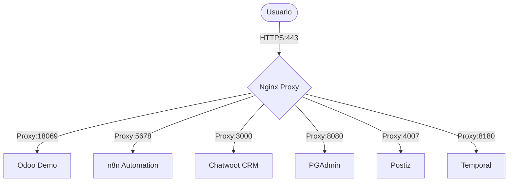

# 🚀 Infraestructura RRHH - *.demo.integraia.lat

Guía completa para el despliegue, configuración y gestión de la infraestructura de servicios en el servidor `62.169.27.210`. Esta configuración utiliza **Nginx** como Proxy Inverso y **Certbot (Let's Encrypt)** para la gestión automatizada de certificados SSL.

---

## 🏗️ Arquitectura de Referencia

La infraestructura se basa en una arquitectura de proxy inverso donde Nginx actúa como puerta de enlace única, gestionando la terminación SSL y redirigiendo el tráfico a los servicios internos (generalmente desplegados en Docker).



---

## 📋 Requisitos Previos

- [ ] **Dominio**: Control total sobre `integraia.lat` para gestión de registros DNS.
- [ ] **Servidor**: Ubuntu 20.04/22.04 LTS con IP pública `62.169.27.210`.
- [ ] **Firewall**: Puertos `80` (HTTP) y `443` (HTTPS) abiertos.
- [ ] **Acceso**: Credenciales SSH con privilegios `sudo`.

---

## ⚙️ Paso 1: Configuración DNS

Es fundamental configurar los registros tipo **A** apuntando a la IP `62.169.27.210` en el panel de control de tu dominio.

| Subdominio | Tipo | Destino | Servicio Asociado |
| :--- | :---: | :--- | :--- |
| `demo` | A | `62.169.27.210` | Odoo Principal |
| `lead.demo` | A | `62.169.27.210` | Odoo Leads |
| `n8n.demo` | A | `62.169.27.210` | n8n Automation |
| `chatwoot.demo` | A | `62.169.27.210` | Chatwoot CRM |
| `pgadmin.demo` | A | `62.169.27.210` | Gestión DB |
| `postiz.demo` | A | `62.169.27.210` | Postiz |
| `temporal.demo` | A | `62.169.27.210` | Temporal IO |
| `integraiadev.demo`| A | `62.169.27.210` | Desarrollo |

> [!TIP]
> La propagación DNS puede tardar de unos minutos hasta 24 horas. Puedes verificar el estado con `dig @8.8.8.8 <subdominio>.integraia.lat`.

---

## 🛠️ Paso 2: Preparación del Servidor

### 2.1 Actualización y Docker
```bash
sudo apt update && sudo apt upgrade -y
curl -fsSL https://get.docker.com -o get-docker.sh && sudo sh get-docker.sh
sudo usermod -aG docker $USER
```

### 2.2 Instalación de Nginx y Certbot
```bash
sudo apt install -y nginx certbot python3-certbot-nginx
```

---

## 🌐 Paso 3: Configuración de Nginx (Proxy Inverso)

### 3.1 Configuración Inicial (HTTP)
Crea el archivo de configuración para gestionar todos los subdominios:
```bash
sudo nano /etc/nginx/sites-available/demo-integraia.conf
```

Utiliza el contenido del archivo de referencia `demo-integraia.conf_simple_without_443`. Este archivo define los `upstreams` y los bloques `server` básicos para el puerto 80.

### 3.2 Activación del Sitio
```bash
sudo ln -s /etc/nginx/sites-available/demo-integraia.conf /etc/nginx/sites-enabled/
sudo nginx -t
sudo systemctl reload nginx
```

---

## 🔒 Paso 4: Seguridad SSL con Certbot

Una vez que los dominios resuelven correctamente a la IP del servidor, solicita los certificados:

```bash
sudo certbot --nginx -d demo.integraia.lat \
                    -d lead.demo.integraia.lat \
                    -d n8n.demo.integraia.lat \
                    -d chatwoot.demo.integraia.lat \
                    -d pgadmin.demo.integraia.lat \
                    -d postiz.demo.integraia.lat \
                    -d temporal.demo.integraia.lat \
                    -d integraiadev.demo.integraia.lat
```

> [!IMPORTANT]
> Cuando Certbot pregunte por la redirección, selecciona la **opción 2 (Redirect)** para forzar todo el tráfico a HTTPS.

---

## 📊 Matriz de Servicios y Puertos

| Servicio | Subdominio | Puerto Interno | Upstream Name |
| :--- | :--- | :---: | :--- |
| **Odoo Demo** | `demo.integraia.lat` | `18069` | `odoo_demo` |
| **Odoo Lead** | `lead.demo.integraia.lat` | `28069` | `lead_demo` |
| **n8n** | `n8n.demo.integraia.lat` | `5678` | `n8n_demo` |
| **Chatwoot** | `chatwoot.demo.integraia.lat` | `3000` | `chatwoot_demo` |
| **PGAdmin** | `pgadmin.demo.integraia.lat` | `8080` | `pgadmin_demo` |
| **Postiz** | `postiz.demo.integraia.lat` | `4007` | `postiz_demo` |
| **Temporal** | `temporal.demo.integraia.lat` | `8180` | `temporal_demo` |
| **Dev Odoo** | `integraiadev.demo.integraia.lat`| `38069` | `integraiadev_demo` |

---

## 🛠️ Comandos de Gestión

| Acción | Comando |
| :--- | :--- |
| **Verificar Nginx** | `sudo nginx -t` |
| **Recargar Nginx** | `sudo systemctl reload nginx` |
| **Logs de Error** | `sudo tail -f /var/log/nginx/error.log` |
| **Probar Renovación SSL**| `sudo certbot renew --dry-run` |
| **Estado Docker** | `docker ps` |

---

## ❓ Solución de Problemas

| Síntoma | Causa Probable | Solución |
| :--- | :--- | :--- |
| **502 Bad Gateway** | El servicio backend no ha iniciado. | `docker ps` para verificar contenedores. |
| **403 Forbidden** | Problema de permisos o index ausente. | Revisar logs en `/var/log/nginx/error.log`. |
| **SSL Validation Fail**| Puerto 80 bloqueado o DNS no listo. | Verificar firewall (`ufw status`) y propagación DNS. |
| **Connection Refused** | Nginx no está corriendo. | `sudo systemctl start nginx`. |

---

> [!NOTE]
> **Aviso**: Este documento asume que los contenedores Docker o servicios backend ya están configurados y escuchando en los puertos mencionados. Si cambias un puerto en el `docker-compose.yml`, debes actualizar el `upstream` correspondiente en Nginx.